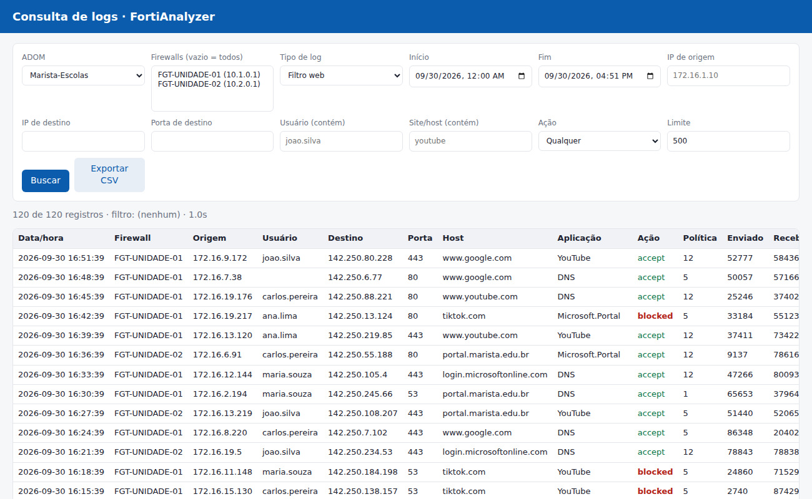

# Consulta de logs do FortiAnalyzer (Sustentação Marista Brasil)

Protótipo de sistema web para a equipe de sustentação consultar logs de acesso
(tráfego, filtro web, aplicação, eventos, DNS...) dos FortiGates que enviam logs
ao FortiAnalyzer, sem precisar de acesso administrativo à GUI do FAZ.



## Arquitetura

```
Navegador (equipe)  ──HTTPS──▶  App (FastAPI)  ──JSON-RPC/HTTPS──▶  FortiAnalyzer
  filtros + tabela               valida filtros       /dvmdb/adom            (ADOMs)
  exportação CSV                 monta expressão      /dvmdb/adom/X/device   (firewalls)
                                 auditoria            /logview/.../logsearch (busca)
```

- **O token do FAZ fica só no servidor** (variável de ambiente); o navegador nunca o vê.
- **Filtros são validados** (IPs com `ipaddress`, texto sem aspas/operadores) antes de virar
  a expressão de filtro do FAZ, evitando injeção de filtro.
- **Auditoria**: cada busca gera uma linha de log `auditoria` com quem buscou, período e filtro
  (importante porque os logs contêm dados pessoais de alunos e colaboradores, LGPD).
- **Fluxo de busca** (LogView apiver 3): `add logsearch` → `get logsearch/{tid}` até
  `percentage=100` → `delete logsearch/{tid}`.

## Preparar o FortiAnalyzer

1. Crie um perfil de administrador **somente leitura** com acesso a *Log View* e *Device Manager*.
2. Crie um administrador do tipo **REST API Admin** com esse perfil, restrito às ADOMs necessárias
   e com *Trusted Hosts* apontando só para o servidor da aplicação.
3. Gere o token de API. O FAZ de produção (v7.4.7) aceita `Authorization: Bearer <token>`.

## Instalar na VM Ubuntu

```bash
git clone <este repositório> && cd fortianalyzer-consulta
sudo ./deploy/install.sh
sudo nano /etc/fortianalyzer-consulta/env   # FAZ_URL e FAZ_API_TOKEN
sudo systemctl restart fortianalyzer-consulta
```

O script cria o usuário de serviço `fazconsulta`, instala em `/opt/fortianalyzer-consulta`,
registra o serviço systemd (escutando só em 127.0.0.1:8000) e publica via nginx em HTTPS
(com certificado autoassinado até vocês trocarem pelo interno). Logs e auditoria:
`journalctl -u fortianalyzer-consulta`.

Para atualizar: `git pull && sudo ./deploy/install.sh`.

## Rodar em desenvolvimento

```bash
python3 -m venv .venv && . .venv/bin/activate
pip install -r requirements.txt
cp .env.example .env    # preencha FAZ_URL e FAZ_API_TOKEN (não versionar o .env)
set -a && . ./.env && set +a
uvicorn app.main:app --host 0.0.0.0 --port 8000
```

Sem acesso ao FAZ, rode com `FAZ_MOCK=true` para usar dados simulados.

## API

| Método | Rota | Uso |
|---|---|---|
| GET | `/api/adoms` | lista ADOMs |
| GET | `/api/adoms/{adom}/devices` | lista firewalls da ADOM |
| POST | `/api/logs` | busca: `adom, devices[], logtype, start, end, srcip, dstip, dstport, user, hostname, action, limit` |

## Próximos passos sugeridos

- Autenticação da equipe via FSSO (planejado) e perfis por unidade/ADOM.
- Paginação além de 1000 linhas e exportação direto do servidor.
- Buscas salvas, e consultas prontas (ex.: "o que o IP X acessou hoje", "bloqueios do usuário Y").
- Empacotar em Docker e publicar atrás de HTTPS interno.
